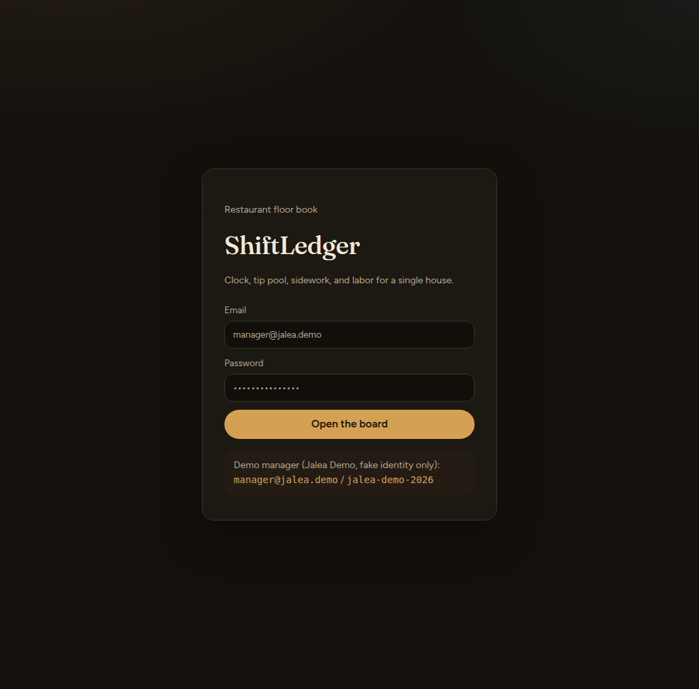
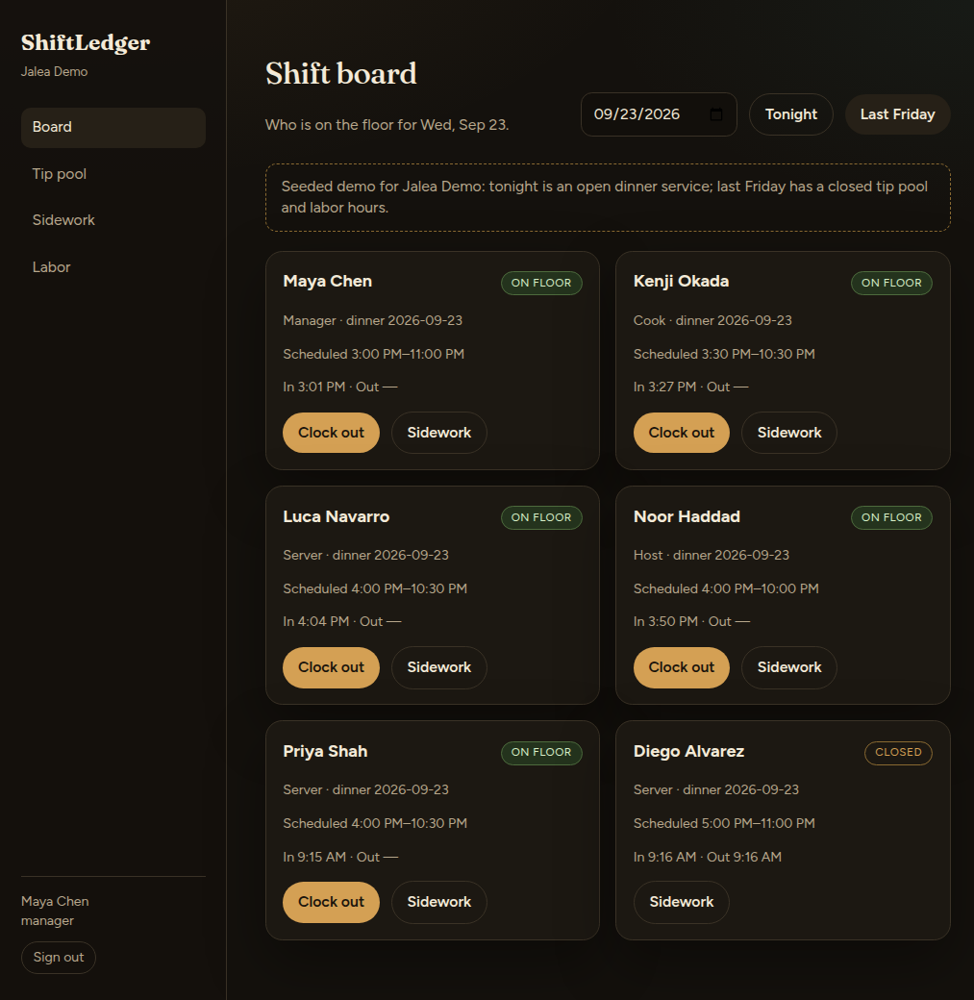
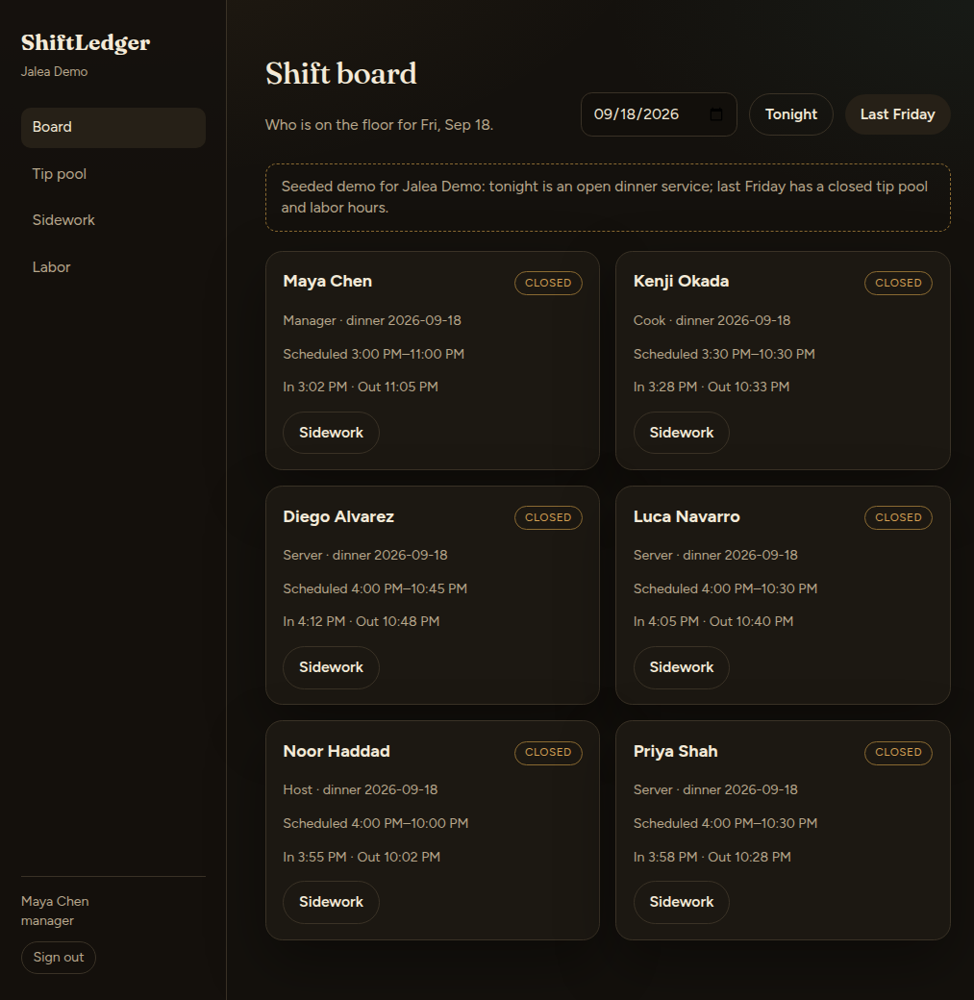
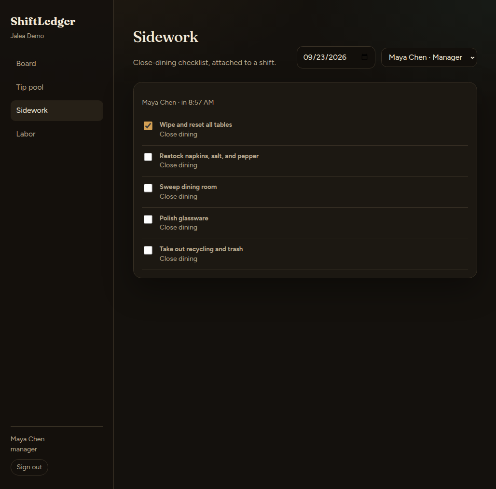
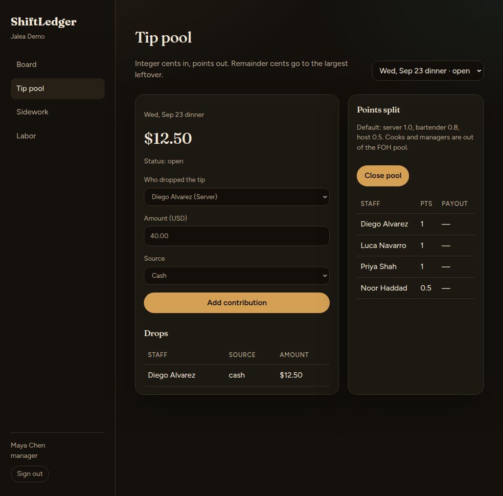
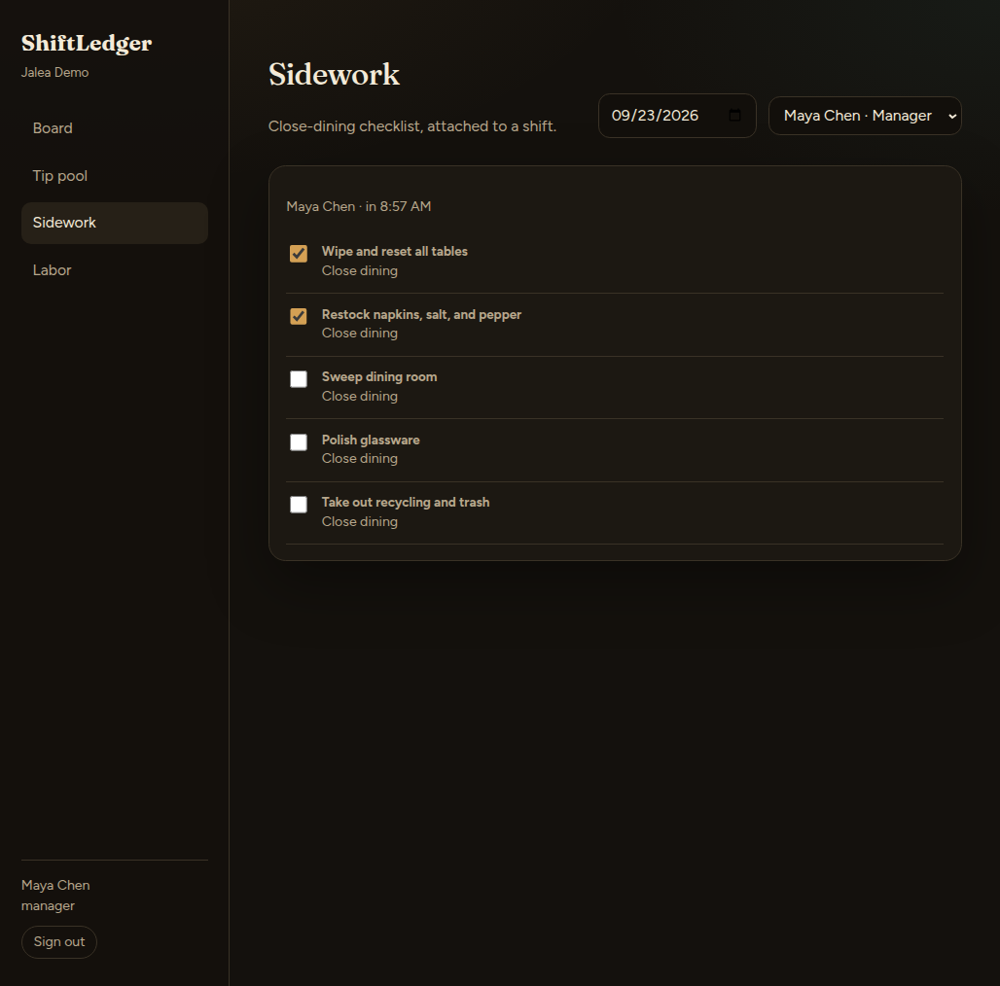
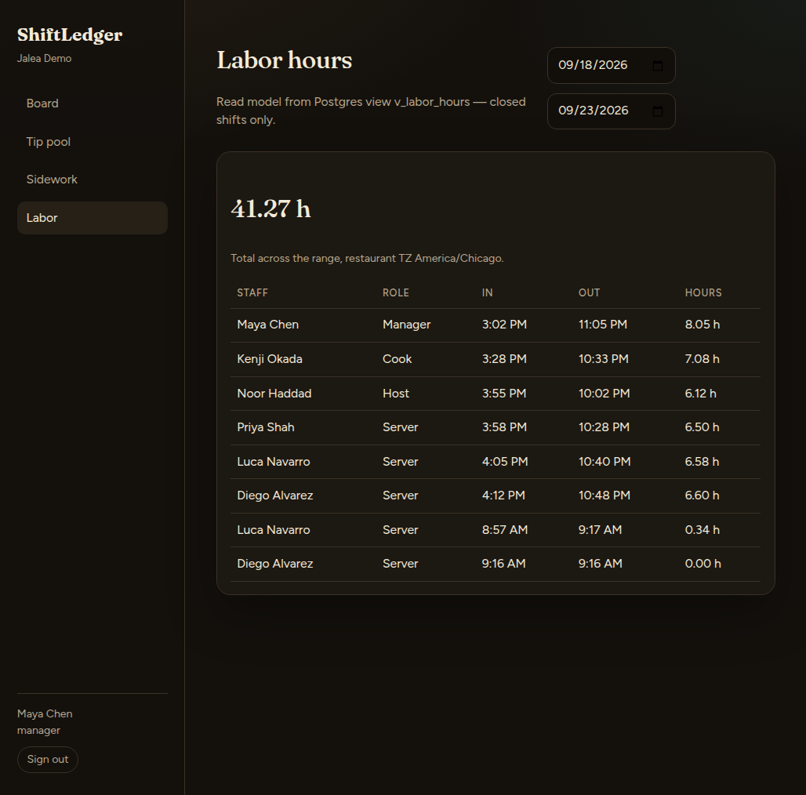

# ShiftLedger

Restaurant floor book for a single house: **shifts**, **tip pools**, **sidework**, and **labor hours**.

This is **v1** of a portfolio demo. The seed restaurant is **Jalea Demo**. Staff names are invented. There is no real PII.









## Stack

| Piece | Choice |
| --- | --- |
| Web | React 19 + Vite + TypeScript (`apps/web`) |
| API | Node + Fastify + TypeScript + `pg` (`services/api`) |
| DB | Postgres 16 |
| Run | Docker Compose (Postgres + API + web) |

## Demo login (manager)

| | |
| --- | --- |
| Email | `manager@jalea.demo` |
| Password | `jalea-demo-2026` |
| Staff | Maya Chen, manager |

Demo-only credentials. Do not reuse anywhere real.

Seeded staff (fake): Maya Chen (manager), Luca Navarro / Priya Shah / Diego Alvarez (servers), Noor Haddad (host), Kenji Okada (cook).

## How to run

### Docker Compose (preferred demo)

```bash
cp .env.example .env
docker compose up --build
```

Then open **http://localhost:8080**.

- Web: `http://localhost:8080`
- API: `http://localhost:3001` (health: `GET /health`)
- Postgres: `localhost:5432` user/password/db `shiftledger`

The API applies `db/migrations/001_init.sql` and `002_seed.sql` on boot.

Reset the volume and re-seed:

```bash
./db/scripts/reset.sh
```

### Local (no containers)

Needs Node 20+ and Postgres 16.

```bash
cp .env.example .env
# create role + database, then:
npm install
npm run migrate
npm run dev:api
npm run dev:web   # another terminal; Vite on http://localhost:5173
```

Vite proxies `/api` to the Fastify server on port 3001.

## What the seed contains

- Restaurant **Jalea Demo**, timezone `America/Chicago`
- Two service periods: **last Friday dinner** (closed tip pool + clocked shifts) and **tonight dinner** (open board), dated in `America/Chicago` (not UTC `CURRENT_DATE`)
- Friday pool: $247.50 in cents, split by points (servers 1.0, host 0.5)
- Sidework template **Close dining** (5 items); Luca’s Friday shift has three checked

On the board, use **Last Friday** to see the closed service, **Tonight** to clock in/out.

## API (v1)

Auth: `Authorization: Bearer <jwt>` after `POST /auth/login`.

| Method | Path | Purpose |
| --- | --- | --- |
| POST | `/auth/login` | JWT |
| GET | `/auth/me` | current user |
| GET | `/shifts?date=` | board |
| POST | `/shifts/:id/clock-in` | |
| POST | `/shifts/:id/clock-out` | |
| GET | `/tip-pools/:periodId` | pool + contributions + payouts |
| POST | `/tip-pools/:id/contributions` | add tip drop (integer cents) |
| POST | `/tip-pools/:id/close` | compute payouts from points |
| GET | `/shifts/:id/sidework` | checklist |
| PATCH | `/shift-sidework/:id` | toggle done |
| GET | `/labor?from=&to=` | hours from `v_labor_hours` (managers) |
| GET | `/staff` | roster |
| GET | `/service-periods` | periods + pool summary |
| GET | `/health` | liveness |

`GET /tip-pools/:periodId` is keyed by **service period id**. Contribute/close use the **tip pool id** returned in that payload.

## Auth

- Passwords hashed with **argon2id**
- Login issues a **JWT** (7-day expiry in this demo)
- The browser stores the token and sends it on each request
- Managers see the full board, may close tip pools, and may read labor
- Staff may clock and toggle sidework on their own shift

**Postgres RLS is deferred.** Queries are scoped in the API with `restaurant_id` from the JWT. Enable RLS when a second tenant exists. See [docs/DECISIONS.md](docs/DECISIONS.md).

## Design decisions (short)

- **Integer cents** for money — no floats
- **Service periods** bind shifts and tips to a meal, not just a calendar date
- Tip split is **points**; `services/api/src/lib/tips.ts` allocates leftover cents with largest remainder
- Labor hours are **read-only** from `v_labor_hours`
- **email_norm** (`lower(trim(email))`) instead of `citext`

Full notes: [docs/DECISIONS.md](docs/DECISIONS.md). Schema: [docs/SCHEMA.md](docs/SCHEMA.md).

## Tests

```bash
npm test
```

Runs the points/payout unit tests (the Friday $247.50 seed case included).

## Out of scope

Payroll tax, POS sync, scheduling AI, multi-location UI, and **Cha Caddy**.

## License

MIT
